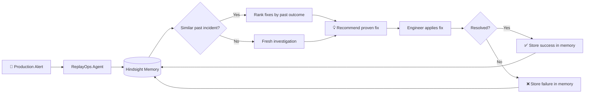
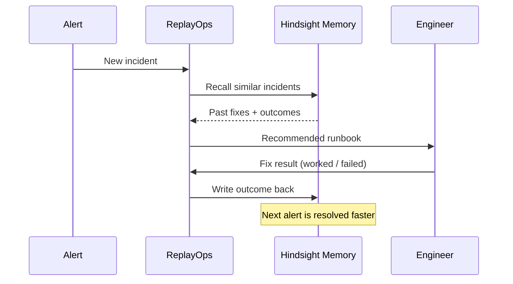

<div align="center">

# 🧠 ReplayOps
### Autonomous AI SRE Platform

**An incident-response agent that remembers every past outage and learns which fixes actually work.**


</div>

---

## 🎯 Executive Summary

ReplayOps is an **AI-powered incident-response agent** built on a persistent memory layer (**Hindsight**). When a production alert fires, it does not start from zero. It recalls the closest historical incident, shows which runbook fixes **failed** and which **worked**, and recommends the proven resolution. After every fix, the outcome is written back to memory, so the system gets faster and safer with each incident.

> Engineers stop digging through logs and stale post-mortems. They get the exact answer their team already learned the hard way.

---

## 🔥 The Problem

| Pain Point | Impact |
|---|---|
| Knowledge lives in scattered logs, chats and old post-mortems | Slow diagnosis, high MTTR |
| Same outages repeat with no institutional memory | Repeated downtime |
| Wrong fixes get retried (e.g. restarting a fragile service) | Cascading failures |
| On-call engineers start from scratch at 3 AM | Fatigue and human error |

---

## 🏗️ System Overview



---

## 🎬 Example Scenario

**Alert:** `Redis connection pool exhausted on payment-service`

ReplayOps queries Hindsight and finds a matching incident (March 14 deployment):

| Candidate Fix | Historical Result |
|---|---|
| Fix A: Restart service | ❌ Failed (caused cascading failure) |
| Fix B: Increase pool size | ✅ Worked |

> **Agent response:** *"This matches a past outage from March. Restarting failed last time. The successful solution was increasing the pool size to 200. Let's apply that."*

---

## 🔁 The Learning Loop



---

## ⚡ Key Capabilities

- **Incident Recall**: Matches new alerts to the most similar historical outages.
- **Outcome-Aware Recommendations**: Ranks runbook fixes by what actually worked, not just what exists.
- **Failure Memory**: Remembers fixes that made things worse so they are never suggested blindly again.
- **Continuous Learning**: Every resolution is written back to memory automatically.
- **Explainable Responses**: The agent states why it recommends a fix, citing the past incident.

---

## 🛠️ Technology Stack

| Tier | Technologies | Source |
|---|---|---|
| Agent Backend | Python | [`backend/`](backend) |
| Memory Layer | Hindsight | [`backend/`](backend) |
| Dashboard | Web frontend | [`frontend/`](frontend) |
| Quality | Automated tests | [`tests/`](tests) |

---

## 🚀 Local Development & Execution

### Run the backend

```bash
# Install dependencies
pip install -r requirements.txt

# Start the agent
python backend/main.py
```

### Run the frontend

```bash
cd frontend
npm install
npm start
```

### Run the tests

```bash
pytest tests/
```

---

## 🗺️ Roadmap

- [ ] Live integration with PagerDuty / Prometheus alerts
- [ ] Auto-execution of approved runbook steps
- [ ] Human-in-the-loop approval before risky actions
- [ ] Post-mortem auto-generation from stored incidents

---

## 👨‍💻 Engineer & Author

**Harivikash Katta**

- GitHub: [@Harry-aura](https://github.com/Harry-aura)
